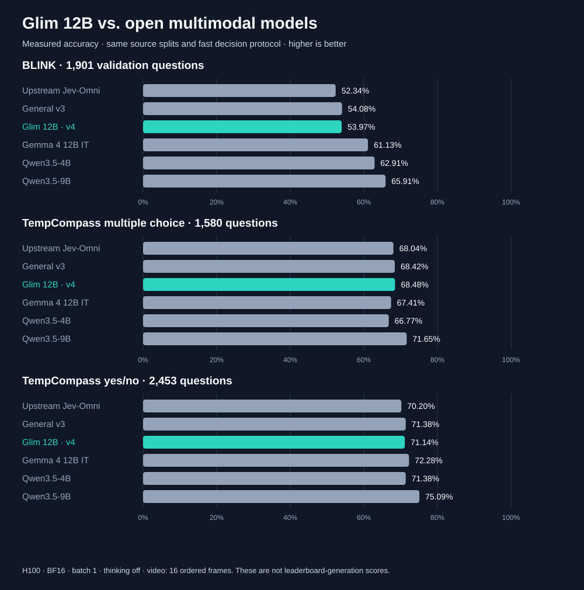
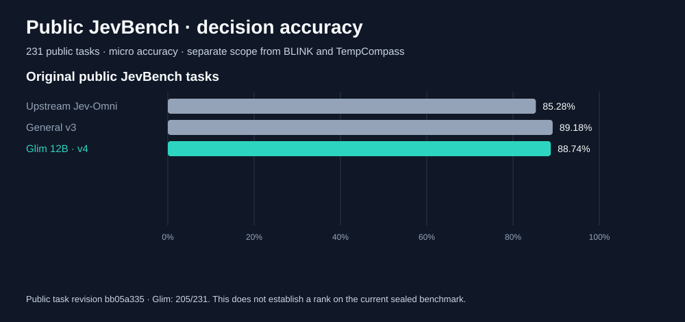

# VL Jev on Modal

Research code for typed decisions over text, images, image sequences, and video. It evaluates open multimodal models and trains the published Jev-Omni decision head on a mixed dataset. All model execution, dataset ingestion, feature extraction, training, and evaluation run in [Modal](https://modal.com/). The local CLI only submits jobs and displays small status results.

This repository contains **code and documentation only**. It contains no model weights, checkpoints, extracted features, training examples, images, videos, or credentials. Those artifacts stay in Modal Volumes or at their original sources.

## Benchmark snapshot





**Glim 12B** is the published unified v4 checkpoint. Charts show measured results; the planned Qwen LoRA candidate has no verified score yet. See the [protocol, counts and limitations](docs/UNIFIED_RELEASE_AND_BENCHMARKS.md) before comparing these results with published leaderboards.

**How the baselines work:** Glim and open Jev-Omni use trained decision heads. Gemma and Qwen are unmodified base-model decision-scoring baselines: one forward pass, thinking disabled, and candidate answer-token logits. They were not fine-tuned into dedicated decision models for these results. The comparison measures constrained decision accuracy; equal architectures and runtime efficiency are not established.

### TypeSafe AI Jev

TypeSafe AI’s hosted [Jev](https://typesafe.ai/blog/introducing-system-one-models-and-jev) is a separate model from the open [Jev-Omni](https://huggingface.co/akhilaaa3/Jev-Omni) checkpoint in the charts. We do not yet have a TypeSafe Jev score on these exact benchmark scopes.

| Comparison | Status |
| --- | --- |
| Glim 12B vs original open Jev-Omni | Measured; shown above |
| Glim 12B vs TypeSafe AI Jev | Pending a shared benchmark and matching scoring protocol |

## Current result

The completed fast-protocol comparison scored unified v4 at **53.97% BLINK,
68.48% TempCompass multiple choice, and 71.14% TempCompass yes/no**. Qwen3.5-9B
scored **65.91%, 71.65%, and 75.09%** on the same source splits. V4 scored
205/231 (88.74%) on public JevBench tasks. This does not establish a SOTA rank.
The [Glim 12B model](https://huggingface.co/ferdinandl007/glim-12b)
is public. Anonymous full-model loading and Choice/Noul/Score outputs were
verified on Modal at revision `7a86292f3b72ea29b8a96d9332e4ef2011d0c8f3`.
The 117,330-example text expansion and its features are saved on Modal;
the 960-example Qwen3.5-9B LoRA pilot completed on Modal. The approved next
run uses 20,000 curated text, image and video examples, prioritizing direct-visual
SoccerNet and preserving human-rated Score tasks. Its H100 job has a runtime
budget and measured-throughput guard. See the [training configuration](docs/GLIM_LORA_PLAN.md).
Workspace usage is capped at $30 and paid spend at $0.
No new candidate benchmark or release is claimed yet.
Full measurements and limits are in the audit linked below.

The [2026-09-30 unified-model and benchmark audit](docs/UNIFIED_RELEASE_AND_BENCHMARKS.md) records all admitted sources, screenshot overlap findings, the new 59,000-example visual-SoccerNet/GUI/general candidate, and the standard-source BLINK/TempCompass comparison protocol. Its external benchmark runs are separate from the historical internal scores below. The unified candidate matches v3's internal general test score at 8,051/9,284 (86.72%); that is not a standard benchmark ranking.

The `general-head-v2` run finished on Modal on 2026-09-30. It trained the 256-slot Jev-Omni decision head on 47,680 mixed training examples, including 6,787 videos, with a **frozen multimodal backbone**. Model code and weights were fetched on Modal from [`akhilaaa3/Jev-Omni`](https://huggingface.co/akhilaaa3/Jev-Omni) at revision `5addda86ddee081a68fb067477ea100c221b8917`. This is supervised head training, not full-backbone fine-tuning or a new pretrained VLM.

| Held-out v2 test set | Correct / total | Accuracy |
| --- | ---: | ---: |
| All decisions | 7,983 / 9,284 | 85.99% |
| Vision decisions | 5,677 / 6,754 | 84.05% |
| Image decisions | 2,361 / 2,827 | 83.52% |
| Video decisions | 3,214 / 3,782 | 84.98% |
| Text decisions | 2,306 / 2,530 | 91.15% |

The pooled vision result exceeds the 83% target. The equal-family vision average is only **72.96%**, however, and GUI next-click accuracy is **30.36%** (34/112). This test mix is dominated by available labeled datasets and does not establish 83% on every visual task or real-world inputs. The text-retention guard passed on development data. These are within-dataset closed-choice results, not a comparison to JevBench, MVBench, GPT models, or a deployed system. The selected `uniform` checkpoint has SHA-256 `e7771cb40f7cc41b5847e2a4880fb498572c86128c5d20cd0cce4f880211f780` and is [published as a separate head on Hugging Face](https://huggingface.co/ferdinandl007/jev-omni-general-head-v2).

The earlier `general-head-v1` run trained on 31,112 examples and scored 82.81% vision (2,148/2,594) and 90.95% text (2,301/2,530) on its held-out test set. The v2 test composition differs substantially, so the two pooled vision percentages are not a like-for-like measure of improvement.

The [general-head v3 GUI mixture](docs/GUI_ACTIONS.md#general-head-v3-training-mixture) added 7,962 labeled web-control and accessibility-tree actions to **full v2 replay**, training on 55,642 examples in total. It retrained the same general-purpose head on Modal, selecting epoch 3 with checkpoint SHA-256 `f1f2b4ba26776198bf0cf716f38159419fb2ba35a881943237de11624182f3e9`. On the unchanged v2 general test, vision rose from **84.05% to 85.12%**, while text moved from **91.15% to 90.99%**. On a derived four-choice benchmark using the official Mind2Web test-task source split, labeled-control accuracy moved from **851/1,086 (78.36%) to 853/1,086 (78.55%)**. That two-example difference is too small to claim a reliable computer-use gain; the task does not measure full-page retrieval or completed browser tasks. Detailed results and limitations are in the GUI document.

The [v3 decision head and full metrics are public on Hugging Face](https://huggingface.co/ferdinandl007/jev-omni-general-head-v3/tree/10e061b811f4add247dc0cbf06a67cb5c0233ad8). Modal anonymously downloaded the released head and matched the training checkpoint hash. The base 12B model and source media are not included.

The classifier head scores supplied options. [`experiments/typed_decisions.py`](experiments/typed_decisions.py) maps those scores to **Choice, Noul, and Score** answers for multiple named questions, including Choice distributions and Score legends/expected levels. The adapter runs one classifier call per question. It is a Python adapter, not a deployed HTTP endpoint or an exact copy of TypeSafe's wire protocol. Its probabilities and concentration-based confidence are raw head outputs; the v3 run does not establish calibration. The upstream head accepts up to 256 options, but its model card only establishes quality through 20. Both structural and real-head three-type smokes run on Modal in `experiments/modal_typed_decisions_smoke.py` and `experiments/modal_typed_decisions_real_smoke.py`.

## Public checkpoint

The [Hugging Face model repository](https://huggingface.co/ferdinandl007/jev-omni-general-head-v2/tree/c2ec13a9db0150333eb50d76dac2d63343d748b6) contains the 3.97 MB head checkpoint, loading instructions, configuration, and detailed metrics. It omits the frozen 12B backbone and all training media. An anonymous readback from Modal matched the original checkpoint hash. To rerun the held-out scoring from that public file and the Modal feature cache:

```sh
modal run -m experiments.modal_verify_published_head --split test \
  --revision c2ec13a9db0150333eb50d76dac2d63343d748b6
```

The training scripts and dataset builders below allow rebuilding the feature cache from pinned upstream sources in your own Modal workspace, subject to each source's access and usage terms.

## Repository map

The [large text expansion](docs/TEXT_DECISION_DATASETS.md) freezes 117,330 new
Choice/Noul/Score training decisions on Modal, including message-list routing,
none-of-these cases, evidence sufficiency and human ordinal ratings. Public
JevBench and Fast Decisions examples remain reserved diagnostics. A candidate
trains with full 59,000-example v4 replay; it does not inherit v4 benchmark scores.

- [`experiments/modal_jev_omni_sports_train.py`](experiments/modal_jev_omni_sports_train.py): frozen-feature extraction, decision-head training, dev selection, held-out evaluation, and checkpoint validation.
- [`experiments/modal_general_v2_pipeline.py`](experiments/modal_general_v2_pipeline.py): detached Modal coordinator for v2 merge, packed feature extraction, training, and evaluation.
- [`experiments/dataset/`](experiments/dataset/): pinned source builders, media materializers, split checks, and dataset audits.
- [`experiments/modal_status_probe.py`](experiments/modal_status_probe.py): compact read-only status from Modal Volumes.
- Other `experiments/modal_*.py` files: model, decision-contract, and video probes.
- [`docs/DATASET_PILOT.md`](docs/DATASET_PILOT.md), [`docs/CONFIDENCE.md`](docs/CONFIDENCE.md), [`docs/TRAINING_AND_RL_PLAN.md`](docs/TRAINING_AND_RL_PLAN.md), and [`docs/GUI_ACTIONS.md`](docs/GUI_ACTIONS.md): dataset provenance, confidence, training, and semantic GUI-action benchmarks. Plans are not claims of completed experiments.

## Run on Modal

Install and authenticate the [Modal CLI](https://modal.com/docs/guide) and run commands from this repository's root. Use your own Modal workspace and budget. Source repositories are pinned in the builders; some require access or may have changed availability. The scripts create and use named Modal Volumes in that workspace.

```sh
# Inspect source availability and dataset state.
modal run -m experiments.dataset.modal_build_general_v1 --mode status
modal run -m experiments.dataset.modal_build_ucf101_full --mode status
modal run -m experiments.dataset.modal_merge_general_v2 --mode status

# When the documented source datasets and materialized media are ready,
# run the v2 pipeline as a detached Modal job.
modal run --detach -m experiments.modal_general_v2_pipeline

# Read compact results without fetching checkpoints or media locally.
modal run -m experiments.modal_status_probe
```

The v2 coordinator expects the v1 general dataset, human-action dataset, and all 13,320 UCF101 videos to be materialized first. The individual builders in `experiments/dataset/` perform those steps; inspect their `main()` modes before launching a full build. `modal run --detach` keeps the remote function active after the submitting terminal disconnects. Do not use `modal volume get` if you want all artifacts to remain in Modal.

## GUI control decisions

The [GUI action study](docs/GUI_ACTIONS.md) replaces coordinate options with named controls and stable element IDs. Its diagnostic jobs and a task-grouped Multimodal Mind2Web pilot run entirely on Modal:

```sh
modal run -m experiments.modal_gui_diagnostics --mode semantic
modal run -m experiments.modal_omniparser_recall --limit 40
modal run --detach -m experiments.dataset.modal_build_mind2web_semantic_pilot
modal run -m experiments.modal_mind2web_semantic_eval
```

Run the pilot evaluation after its builder finishes. The pilot uses one pinned training shard and a development split; it is not an official Mind2Web test score. Screenshots, parsed rows, and results remain in Modal Volumes.

## Data and model rights

The **MIT license applies only to code and documentation in this repository**. It does not grant rights to third-party datasets, footage, images, model weights, or model code. The mixed dataset is marked research-only because source terms and underlying media rights differ; review each source before redistribution or commercial training. In particular, no fetched third-party media or generated labels are published here. See [dataset notes](docs/DATASET_PILOT.md).

Jev-Omni is an independent upstream model. This project is not affiliated with TypeSafe AI and does not reproduce TypeSafe's unpublished model or training method. Closed-choice logits and confidence concentration are not calibrated probabilities without a held-out calibration study.

## Glim publication and next training stage

The model is named **Glim 12B**. The legacy model link redirects to the named
repository; native head weights are unchanged. See
[Ollama compatibility](docs/OLLAMA_COMPATIBILITY.md) and
[LoRA plan](docs/GLIM_LORA_PLAN.md). Future external comparisons run Glim only
on exact published benchmark subsets and reuse published competitor scores.
